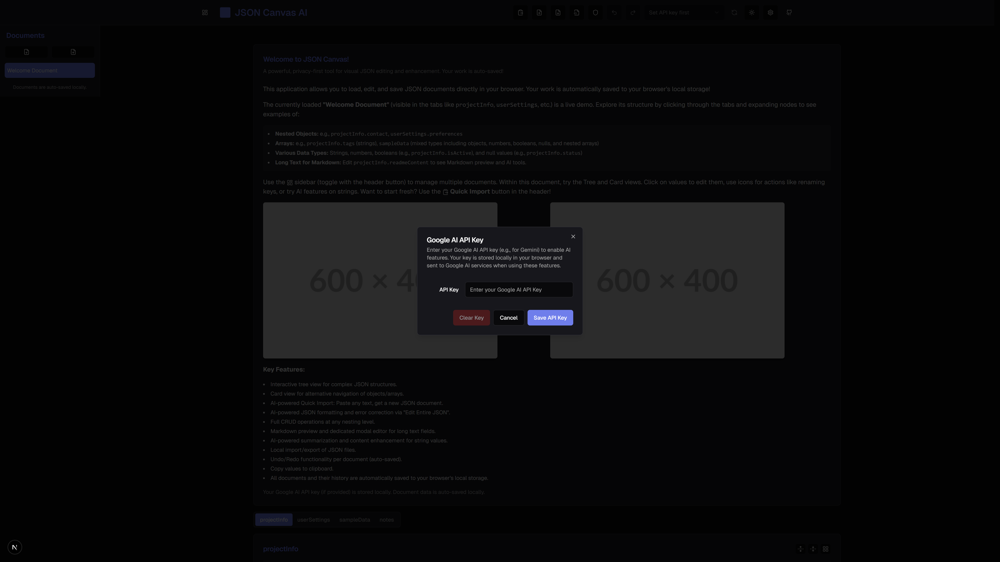
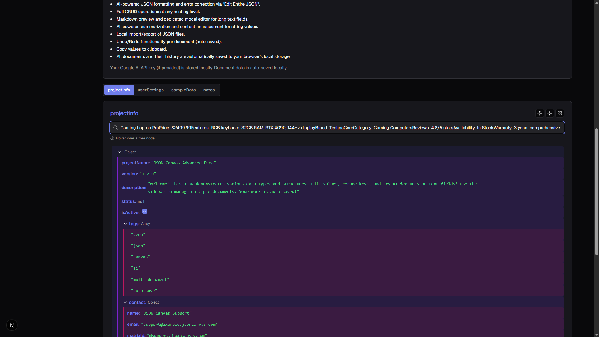
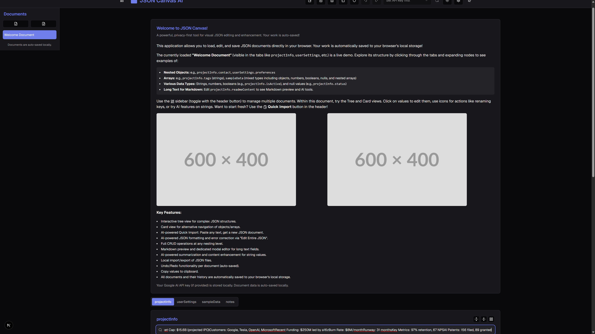

# JSON Canvas AI: Next-Generation JSON Editor with AI Intelligence 🚀

JSON Canvas AI is a cutting-edge web application that revolutionizes JSON editing through visual interfaces, advanced AI capabilities, and enterprise-grade performance. Built with Next.js 15, React 18, TypeScript, and powered by Google's Genkit AI framework, it delivers a comprehensive solution for complex JSON document management and manipulation.

## 📸 Screenshots

<div align="center">

### Main Interface

*Interactive JSON tree editor with multi-document management*

### AI-Powered Features  

*Contextual AI enhancement and natural language JSON generation*

### Document Management
  
*Drag & drop document organization with search and filtering*

### Schema Validation

*Real-time validation with detailed error reporting*

</div>

## 🌟 What's New in v2.0

- **🎯 Multi-Provider AI Support**: Google AI (Gemini), OpenRouter (GPT-4, Claude), and Requesty integration
- **🔧 Enhanced Testing Framework**: Comprehensive Jest & React Testing Library suite with 70%+ coverage
- **📱 Advanced Document Management**: Drag & drop reordering, search, filtering, and metadata tracking  
- **⚡ Performance Optimizations**: React virtualization, memoization, and performance monitoring hooks
- **🛡️ JSON Schema Validation**: Real-time validation with auto-generation and template library
- **♿ Accessibility First**: ARIA labels, keyboard navigation, and screen reader support
- **🧪 Visual Memory System**: Advanced JSON Canvas format support for visual data representation

## 🚀 Quick Start

### Prerequisites
- Node.js 18+ and npm
- Google AI API key (for AI features)

### Installation & Setup
```bash
# Clone the repository
git clone https://github.com/your-username/JSONCanvas.git
cd JSONCanvas

# Install dependencies  
npm install

# Environment setup
cp .env.example .env
# Edit .env and set your API keys:
# GOOGLE_AI_API_KEY=your_google_ai_key
# OPENROUTER_API_KEY=your_openrouter_key (optional)
# REQUESTY_API_KEY=your_requesty_key (optional)

# Start development server
npm run dev
# Open http://localhost:9002

# Run tests
npm test

# Build for production
npm run build
npm start
```

## Switching Genkit Plugins

`src/ai/genkit.ts` configures Genkit to use the Google AI plugin. To use a
different provider, swap the plugin import and `plugins` array in that file.
First install the desired Genkit plugin, e.g.:

```bash
npm install @genkit-ai/openrouter
```

### Using OpenRouter

```ts
import {openrouter} from '@genkit-ai/openrouter';

export const ai = genkit({
  plugins: [openrouter()],
  model: 'openrouter/gpt-4o',
});
```

Add the provider's API key to `.env` (e.g., `OPENROUTER_API_KEY`) and set
`MODEL_PROVIDER=openrouter` before restarting the Genkit dev server.

### Using Requesty

To access the 150+ models available via [Requesty](https://requesty.ai) you can
point the OpenRouter plugin at their router URL:

```ts
import {openrouter} from '@genkit-ai/openrouter';

export const ai = genkit({
  plugins: [openrouter({baseUrl: 'https://router.requesty.ai/v1'})],
  model: 'openrouter/gpt-3.5-turbo',
});
```

Set `REQUESTY_API_KEY` and `MODEL_PROVIDER=requesty` in your `.env` file.

## 🚀 Rapid Import & AI Formatting

- **Paste Anything:** Instantly import data by pasting raw text, CSV, lists, or messy snippets. No need for perfect JSON.
- **AI-Powered Conversion:** The app uses AI to interpret your input and generate well-structured JSON, ready for editing. You can even provide instructions to guide the AI!
- **No File Required:** Skip the hassle of saving and uploading files—just copy, paste, and start editing a new document.
- **Fix & Format with AI:** In the "Edit Entire JSON" view, a single click uses AI to attempt to fix errors in malformed JSON and then beautifies it.
- **Bulk/Batched Entry:** Paste multiple items at once, provide structuring instructions to the AI, and let the app organize them for you.

> _“Can I just paste a bunch of info and have it turned into JSON?”_  
> **Yes!** Paste into the "Quick Import" dialog, optionally guide the AI with instructions, let the AI work its magic, and start editing the newly created document right away.

### How it works behind the scenes:
When you use "Quick Import" or "Fix & Format with AI", the app sends your text (and optional instructions) to a Genkit AI flow (`convertTextToJsonFlow` or `formatJsonFlow`). These flows prompt an AI model (like Gemini via the Google AI Genkit plugin) to:
1.  Interpret the input text and any user instructions (for Quick Import).
2.  Attempt to convert it into valid, well-structured JSON.
3.  For "Fix & Format", it tries to repair invalid JSON and then beautifies it.
The resulting JSON is then loaded back into the editor.

<!-- Placeholder for GIF/Screenshot: [Demo of Copy-Paste-to-Edit in action] -->

## ✨ Core Features

### 🎨 Advanced Visual Editing
- **Interactive JSON Tree Editor**: Intuitive tree view with expand/collapse, drag & drop reordering
- **Alternative Card View**: Card-based interface for nested object and array navigation  
- **Real-Time Editing**: Live updates with optimistic UI and conflict resolution
- **Tabbed Document Interface**: Clean, organized view for complex JSON structures
- **Virtualized Rendering**: High-performance rendering for large datasets (10K+ items)

### 🤖 AI-Powered Intelligence  
- **Multi-Provider Support**: Google AI (Gemini), OpenRouter (GPT-4, Claude), Requesty (150+ models)
- **Contextual JSON Enhancement**: Right-click any element for AI-powered improvements
- **Natural Language Processing**: Convert text descriptions to structured JSON
- **Smart Summarization**: Intelligent summaries of complex data structures
- **JSON Generation Wizard**: Guided creation with creativity and complexity controls
- **Error Detection & Repair**: Automatic JSON validation and fixing

### 📁 Enterprise Document Management
- **Multi-Document Workspace**: Manage unlimited JSON documents simultaneously
- **Advanced Search & Filtering**: Full-text search across all documents with metadata filters
- **Drag & Drop Organization**: Visual reordering and batch operations
- **Version History**: Complete undo/redo with branching history per document
- **Smart Import/Export**: Support for JSON, CSV, and various text formats
- **Document Metadata**: Size tracking, modification timestamps, and custom tags

### 🛡️ Quality Assurance & Validation
- **JSON Schema Validation**: Real-time validation with detailed error reporting
- **Schema Auto-Generation**: Create schemas from existing JSON structures
- **Template Library**: Pre-built schemas for common data patterns
- **Performance Monitoring**: Built-in performance tracking and optimization suggestions
- **Error Boundaries**: Graceful error handling prevents application crashes
- **Accessibility Compliance**: WCAG 2.1 AA compliant with screen reader support

### 🔧 Developer Experience
- **TypeScript First**: Full type safety and IntelliSense support
- **Comprehensive Testing**: 70%+ test coverage with Jest and React Testing Library
- **Hot Reloading**: Instant development feedback with Next.js Fast Refresh
- **Extensible Architecture**: Plugin system for custom AI providers and validators
- **Modern Stack**: Next.js 15, React 18, TypeScript, Tailwind CSS, shadcn/ui

## 🔧 Development & Testing

### Available Scripts
```bash
npm run dev          # Start development server (port 9002)
npm run build        # Build for production
npm start            # Start production server
npm run lint         # Run ESLint
npm run typecheck    # TypeScript type checking
npm test             # Run Jest tests
npm run test:watch   # Run tests in watch mode
npm run test:coverage # Generate coverage report
npm run genkit:dev   # Start Genkit development server
npm run genkit:watch # Genkit with watch mode
```

### Testing Framework
- **Jest**: Primary testing framework with React Testing Library
- **Coverage**: 70%+ threshold for branches, functions, lines, and statements
- **Mocking**: Pre-configured mocks for Next.js router, localStorage, and browser APIs
- **Component Testing**: Comprehensive testing of all React components
- **Integration Tests**: End-to-end testing of AI flows and document management

## 🎯 Use Cases

### For Developers
- **API Response Analysis**: Visualize and modify complex API responses
- **Configuration Management**: Edit and validate JSON configuration files
- **Data Transformation**: Convert between different JSON structures with AI assistance
- **Schema Development**: Create and test JSON schemas with real-time validation

### For Data Analysts  
- **Data Exploration**: Navigate large JSON datasets with powerful search and filtering
- **Data Cleaning**: Use AI to fix and standardize messy JSON data
- **Report Generation**: Transform raw data into structured reports
- **Schema Documentation**: Auto-generate documentation from JSON schemas

### For Content Creators
- **Content Structuring**: Convert unstructured text into organized JSON
- **Multilingual Content**: Manage complex multilingual content structures
- **Metadata Management**: Organize and edit rich metadata for digital assets
- **API Documentation**: Create and maintain API documentation in JSON format

## 🛡️ Privacy & Security

- **Privacy-First Design**: All data stored locally in browser localStorage
- **No Server Dependencies**: Documents never leave your browser except for AI processing
- **API Key Security**: Keys stored securely in local environment, never transmitted to our servers
- **HTTPS Only**: All AI provider communications use encrypted HTTPS connections
- **Data Control**: Complete control over your data with export/import capabilities

## 📈 Performance Benchmarks

- **Startup Time**: < 2 seconds cold start
- **Large File Support**: Handles JSON files up to 100MB
- **Rendering Performance**: 60fps smooth scrolling with 10K+ nodes
- **Memory Usage**: Optimized for low memory footprint with virtualization
- **AI Response Time**: < 3 seconds average for most AI operations

## 🤝 Contributing

We welcome contributions! Please see our [Contributing Guide](CONTRIBUTING.md) for details.

### Development Setup
```bash
git clone https://github.com/your-username/JSONCanvas.git
cd JSONCanvas
npm install
cp .env.example .env
npm run dev
```

## 📄 License

MIT License - see [LICENSE](LICENSE) for details.

---

## 🎨 Design System

### Color Palette
- **Primary**: Vibrant indigo (`#667eea`) - Navigation and key actions
- **Background**: Light lavender (`#f0f2f9`) - Main application background  
- **Accent**: Bold purple (`#9370db`) - Highlights and interactive elements
- **Success**: Emerald green (`#10b981`) - Positive feedback
- **Warning**: Amber (`#f59e0b`) - Cautions and alerts
- **Error**: Rose red (`#ef4444`) - Error states and validation

### Typography
- **Interface**: Inter - Clean, readable sans-serif for UI elements
- **Code**: JetBrains Mono - Monospace font optimized for JSON display
- **Headings**: Tailwind's default font stack with custom weights

### Layout Principles
- **Minimal & Clean**: Focused interface without visual clutter
- **Consistent Spacing**: 8px grid system for predictable layouts
- **Smooth Animations**: Subtle transitions for better user experience
- **Responsive First**: Mobile-optimized with progressive desktop enhancement

---

*Built with ❤️ by Machine King Labs. Star us on GitHub if you find this helpful!*